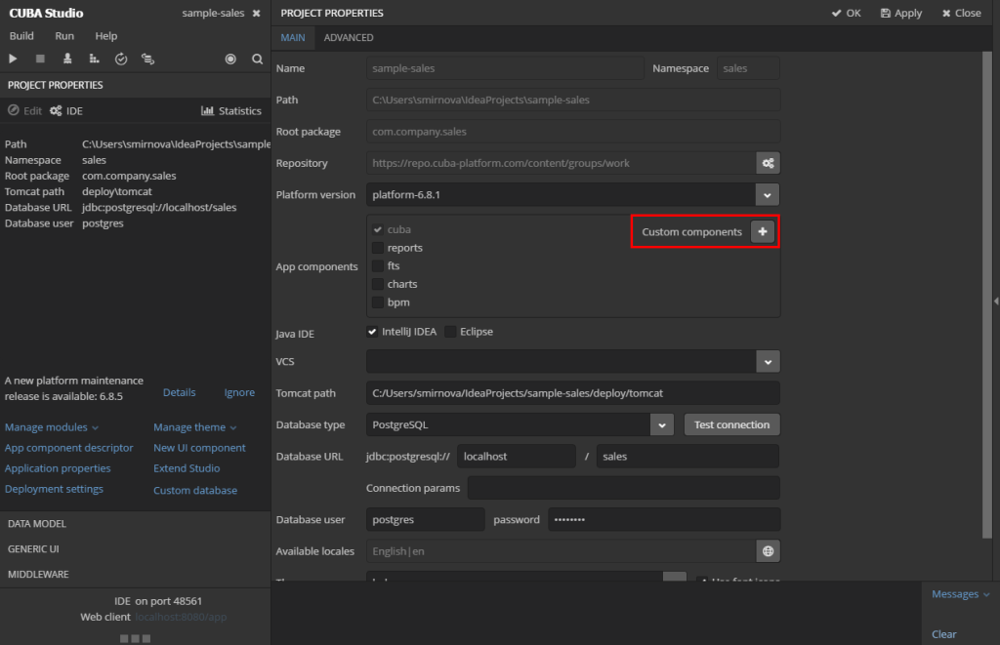
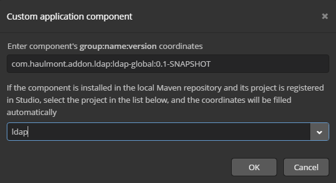
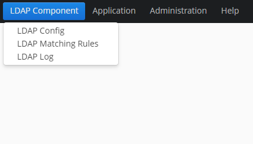
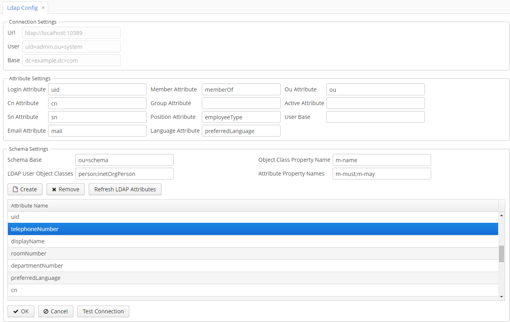
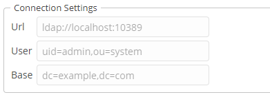
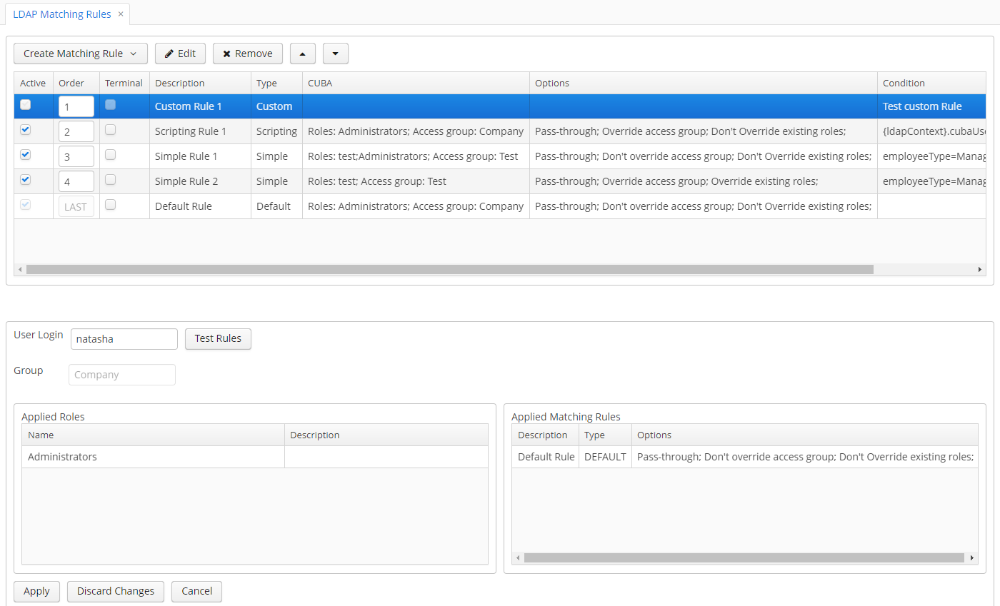
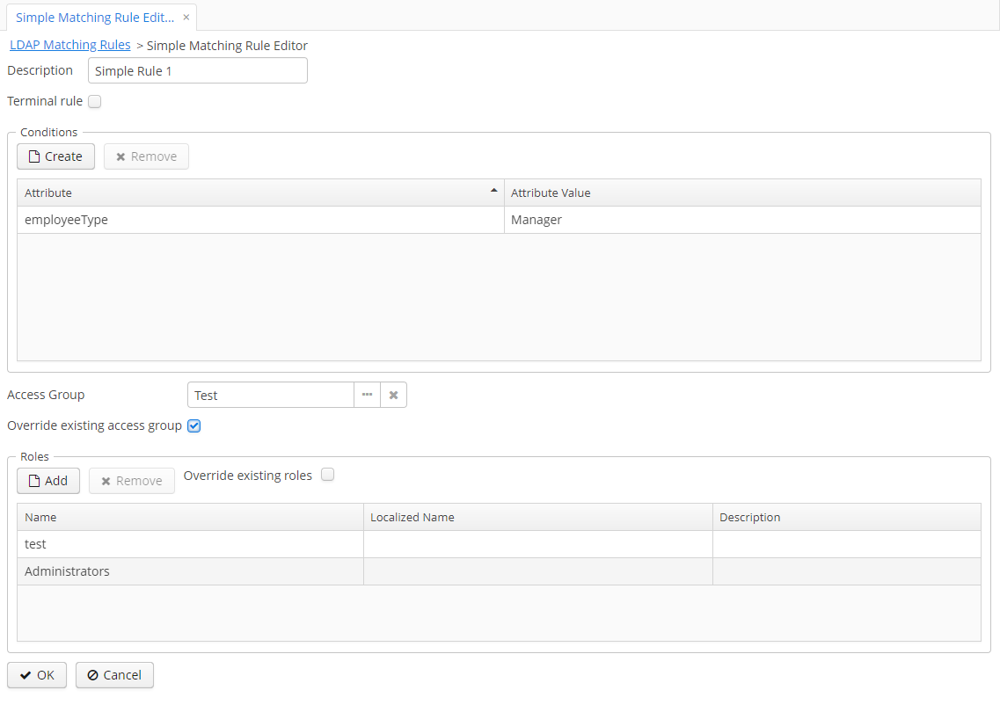
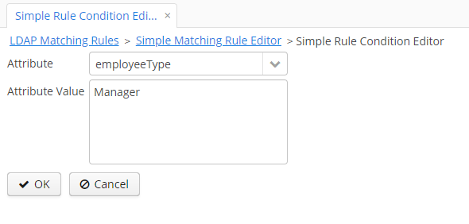
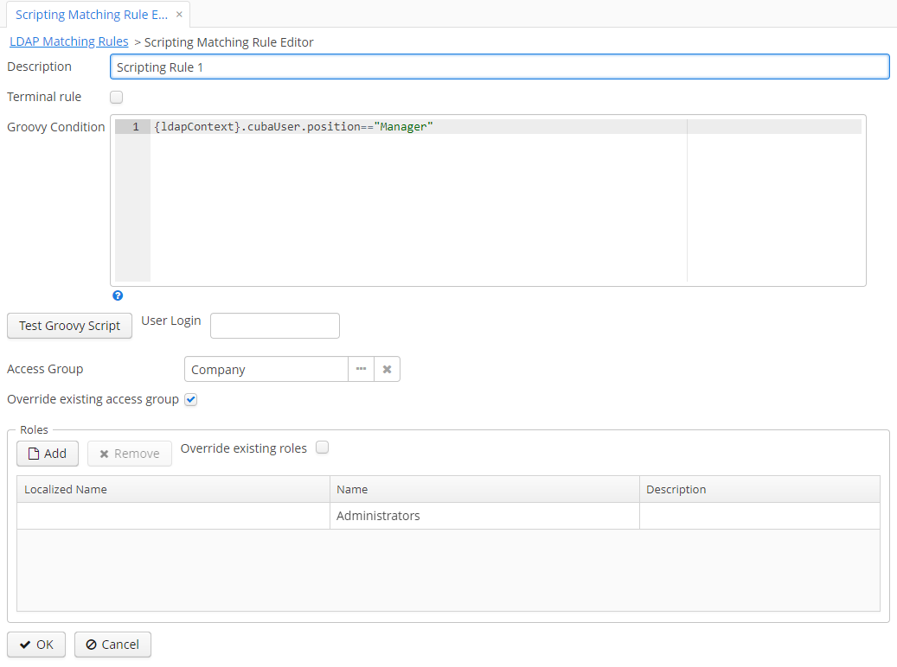

Please pay attention that the component is still being developed and not stable.

# Table of Contents

- [Overview](#overview)
- [Getting Started](#getting-started)
    - [Prerequisites](#prerequisites)
    - [Installation](#installation)
    - [Additional Information](#additional-information)
- [Features](#features)
    - [LDAP Config](#ldap-config)
    - [LDAP Matching Rules](#ldap-matching-rules)
    - [Testing LDAP Matching Rules](#testing-ldap-matching-rules)
    - [LDAP Log](#ldap-log)
- [API](#api)
- [Known Issues](#known-issues)

# Overview

The LDAP Integration CUBA component provides a readily available instrument for employing features of a directory
server, e.g. Active Directory, in any CUBA-based application.
The component is available for CUBA applications of any complexity and does not require any additional third-party 
frameworks or libraries to be installed.

The component comprises the following functionalities:

* Storing user credentials in the LDAP database;
* Using a single set of credentials in all applications having LDAP enabled;
* Configuring LDAP parameters and the directory server schema;
* Setting up rules for assigning roles and access groups to users.

# Getting Started

## Prerequisites

Before enabling the component, it is required to configure a directory server, so that it was accessible for the 
component features, and set up LDAP connection parameters.

## Installation

To add the LDAP component to your project, the following steps should be taken:

1. Open your application in CUBA Studio. 

2. Edit Project properties.

3. Click the plus button in the *App components* section of the *Main* tab.

    

4. Specify the coordinates of the component in the corresponding field as follows: group:name:version.
   Click *OK* to confirm the operation.
    
    
    
    * Artifact group: *com.haulmont.addon.ldap*
    * Artifact name: *ldap-global*
    * Version: *0.1-SNAPSHOT*
    
        When specifying the component version, you should select the one, which is compatible with the platform version used
    in your project.
    
    | Platform Version | Component Version |
    |------------------|-------------------|
    | 6.8.1            | 0.1-SNAPSHOT      |
    
5. Before using the component as a part of your application, it is vital to configure initial values for connecting to
the LDAP server, and to set up basic attribute names for the LDAP user in the `app.properties` file.
An example of how to set up these properties is given below.

```properties
ldap.contextSourceUrl = ldap://localhost:10389
ldap.contextSourceBase = dc=example,dc=com
ldap.contextSourceUserName = uid=admin,ou=system
ldap.contextSourcePassword = secret
```

6. Specify the following properties in the `web-app.properties` file:

```properties
cuba.web.externalAuthentication = true
cuba.web.externalAuthenticationProviderClass = com.haulmont.addon.ldap.web.extauth.LdapComponentAuthProvider
cuba.web.standardAuthenticationUsers = admin
```

## Additional Information

You should keep in mind that the LDAP component should be enabled for each CUBA application, which is expected to use
its functionalities.

# Component Functionalities

## LDAP Config

Once you have successfully installed the component, check that all configured property values are displayed properly 
on *LDAP Config Screen* (Menu: LDAP Component → LDAP Config).





The screen comprises three sections: *Connection settings*, *Attribute Settings* and *Schema Settings*. The description
of each section is given below.

### LDAP Connection Settings

The *Connection settings* section of *LDAP Config Screen* allows viewing and testing LDAP connection properties right from the
application UI.



Clicking the *Test Connection* button at the bottom of the screen launches connection testing. If the connection is 
successfully established, the corresponding message is displayed.

### Basic Attributes

When a user logs in using LDAP credentials for the first time, a new user entity is created in the CUBA application.
All details about the user are taken from the LDAP database (configuring these details is a part of preparation 
activities). In order to match LDAP attributes and the fields of the User entity, use the *Attribute Settings* section of 
*Load Config Screen*.


### LDAP Schema

The *Schema Settings* section allows configuring a set of rules that define what can be stored as entries in the LDAP 
directory. 


Using the table provided in the section, it is possible to set up attributes that can be used as conditions when applying
matching rules. Clicking the *Refresh LDAP attributes* button uploads all attributes of the specified LDAP user object class.
However, it is possible to add attributes manually by using the *Create* button.

## LDAP Matching Rules

LDAP matching rules are special rules for configuring access rights for users. When a user logs in using LDAP credentials
for the first time, a new user entity is created in the CUBA application. Using matching rules, it is possible to set up
access groups and roles for new application users. There are four rule types intended for this purpose: custom,
default, simple and scripting. Creating and managing LDAP matching rules is available from *LDAP Matching Rule Screen*
(Menu: LDAP Component → LDAP Matching Rules).



The screen comprises the table of matching rules and the section for testing how the existing matching rules are
applied to a particular user (see [Testing LDAP Matching Rules](#testing-ldap-matching-rules)).
Using the table, it is possible to enable/disable certain rules by ticking checkboxes in the *Active* column. Another
important thing is that rules have their order numbers, according to which they are applied. 
The default rule is always applied the last.

The description of all rule types and their peculiarities is provided in the sections below.

### Custom Rule

The LDAP component provides means to process custom rules defined programmatically. These rules can be created only by 
adding new classes to the source code of your application. Custom rules can be viewed from the application UI, however,
they cannot be configured or amended there.

One of the advantages of custom rules is that they allow specifying additional conditions not related to LDAP attributes or schema.
The example of a custom rule is provided below.

```java
@LdapMatchingRule(description = "Test Custom Rule")
public class TestCustomLdapRule implements CustomLdapMatchingRule {

    @Inject
    private LdapUserDao ldapUserDao;

    @Inject
    private LdapConfig ldapConfig;

    @Inject
    private CubaUserDao cubaUserDao;

    @Override
    public boolean applyCustomMatchingRule(ApplyMatchingRuleContext applyMatchingRuleContext) {
        if (applyMatchingRuleContext.getLdapUser().getLogin().equalsIgnoreCase("barts")) {
            User admin = cubaUserDao.getCubaUserByLogin("admin");
            applyMatchingRuleContext.getCurrentRoles().add(admin.getUserRoles().get(0).getRole());
            applyMatchingRuleContext.setCurrentGroup(admin.getGroup());
            applyMatchingRuleContext.getAppliedRules().add(new CustomLdapMatchingRuleWrapper(this));
        }
        return false;
    }
}
```

### Default Rule

When launching your application for the first time after the component installation, the default rule is automatically 
created in the system.

It is used if none of other rules were applied, e.g. conditions for applying existing rules were not met.
That is why it contains the 'LAST' value in the *Order* field.

The default rule can be amended by clicking the *Edit Default Rule* button. All fields and settings present in *Default
Matching Rule Editor* are described in the section below.

#### Default Matching Rule Editor


* *Description*: a short description of the default rule.
* *Terminal rule*: if checked, then other rules cannot be applied, if the default rule was used.
* *Access group*: an access group to be assigned to a user, if the default rule is applied.
* *Override existing access group*: if checked, then an access group that was previously assigned to a user is removed
and the group specified in the 'Access group' field is used instead.
* *Override existing roles*: if checked, then all roles that were previously assigned to a user are removed and the ones
specified in the 'Roles' section are used instead.

The *Roles* table allows creating a set of roles, which are assigned to a user, if the default rule is used.

### Simple Rule

Simple rules allow granting access rights (by assigning an access group and roles) to users, if particular conditions are met.
To create a simple rule, select the *Create simple rule* option from the menu of the *Create matching rule* button. 

#### Simple Matching Rule Editor



*Simple Matching Rule Editor* comprises settings and tables for configuring simple matching rules:

1. __General details and settings__. The fields are similar to the ones described in [Default Matching
Rule Editor](#default-matching-rule-editor).
2. __Conditions__. The section enables to add conditions, which have to be met for successful rule application. Clicking
the *Create* button opens Simple Rule Condition Editor.



The editor contains the following fields:

* *Attribute*: defines an LDAP attribute, which will be checked before applying a current simple rule.

**Note:** Before creating conditions it is required to add them to the existing LDAP Schema (for more details, please
refer to [LDAP Schema](#ldap-schema)).

* *Attribute Value*: defines a value of the selected attribute. The rule will be applied to those user entities, which
have the specified value of the selected attribute.

3. _Roles_. The section is designed to add user roles, which will be assigned to a user in case of successful rule application.

### Scripting Rule

Using scripting rules it is possible to specify a Groovy script with a set of conditions to be met to grant a user
access rights. You can create a new scripting rule by selecting the *Create Scripting Rule* option from 
the menu of the *Create matching rule* button.

#### Scripting Matching Rule Editor

*Scripting Matching Rule Editor* comprises a set of general fields (these fields are similar to the ones described in 
[Default Matching Rule Editor](#default-matching-rule-editor)), a section for specifying and testing Groovy scripts,
and a table of roles.



An entered condition is evaluated using LDAP matching rule context. Note that the `{ldapContext}` placeholder should
be used as an alias of the LDAP matching rule context. The `{ldapContext}` provides the following fields:

* *ldapUser*: defines the main LDAP person properties (login, cn, sn, email, memberOf, accessGroups, isDisabled, position,
language, ou).
* *appliedRules*: matching rules, which were previously applied to the context.
* *roles*: roles, which were previously assigned to a user.
* *group*: a current access group that a user belongs to.
* *cubaUser*: a CUBA user, to whom a current matching rule is applied.
* *isTerminalRuleApply*: signals that a current rule is a terminal one, i.e. once it is used, no other rules can be applied.

## Testing LDAP Matching Rules

After creating all required matching rules, it is possible to test them right from *LDAP Matching Rule Screen*. For this 
purpose, enter a user login in the corresponding field and click *Test rules*.

After that, the applied matching rules and roles are displayed in the corresponding tables. This functionality is useful if it
is required to find out whether a rule was applied correctly.

## LDAP Log

LDAP Log Screen can be used to view all activities related to LDAP connection from the application UI,
including user authentication checks, rule application, updates of user properties and errors that occur while the component
features are used.